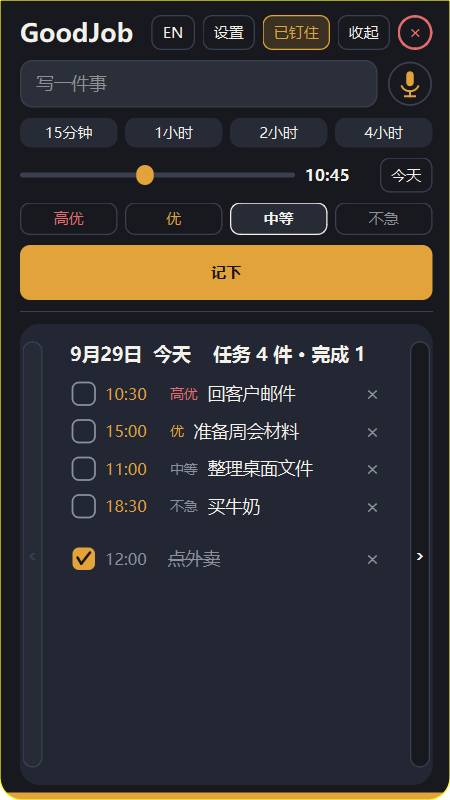
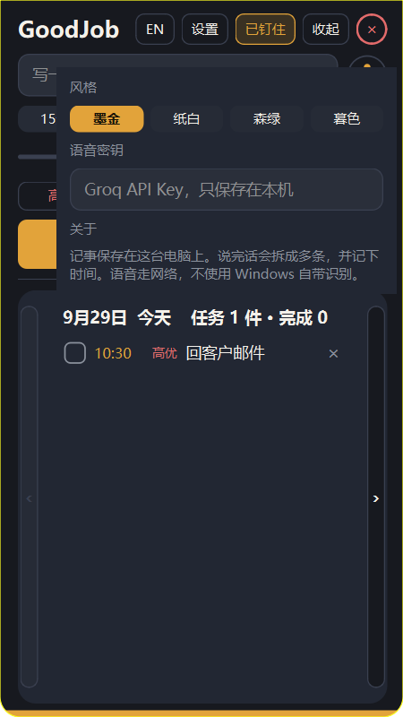

# GoodJob

[中文](#中文) · [English](#english)

## 中文

贴在屏幕边上的记事和提醒。窗口可以拖动，拖到屏幕左、右或上边缘会吸附；鼠标移开就收回，再拖回屏幕中间就松开。

### 界面

主界面：记下一件事，并按优先级看今天的安排。



设置：风格、语音密钥和关于。



### 特性

- **贴边。** 拖到屏幕边缘后吸附。鼠标离开面板会收回，只留一条边。可以钉住，让它一直展开。
- **按天查看。** 今天、明天、后天各是一张卡片。点两侧的长箭头，整张卡片左右滑过去。标题一行写出日期、未完成件数和已完成件数。
- **时间。** 第一排是 15 分钟、1 小时、2 小时、4 小时。第二排用滑动条选具体钟点，日期默认今天，也可以改成别的日子。
- **优先级。** 高优、优、中等、不急。新建时默认中等。列表里没做完的排在上面，并按优先级排序。做完的在下面，文字上画杠。
- **修改和删除。** 点任务内容可以改标题、时间和优先级。点行末的叉会删掉这一条。
- **昨天没做完的。** 今天的卡片上可以把它移到今天，时间还是原来的钟点。
- **中英文。** 点顶部的 EN / 中文切换。软件名始终是 GoodJob。
- **四种风格。** 墨金、纸白、森绿、暮色，在设置里点选。
- **提醒。** 到点后从托盘弹出通知，面板也会滑出来。
- **语音。** 输入框旁边的话筒用来说话。说完后会拆成多条记事，并尽量认出时间。需要能上网。如果访问不到 Google 语音，在设置里填写 Groq API Key，密钥只留在本机。

### 如何使用

1. 从 [发布页](https://github.com/GitHubTheSun/GoodJob/releases) 下载 `GoodJob.exe`，双击打开。不需要安装 Python。
2. 在输入框写下要做的事，选优先级和时间，点 **记下**。
3. 点卡片两侧的箭头查看明天和后天。
4. 点任务文字修改，点叉删除，点方框表示做完。
5. 拖动标题栏可以移动窗口。靠到屏幕边缘会贴住。点 **收起** 立刻收回，点 **钉住** 保持展开。
6. 点右上角的圆圈叉退出。托盘图标上也可以打开或退出。

记事保存在本机的 `%LOCALAPPDATA%\GoodJob`，不会上传。

从源码运行：

```bat
python -m venv .venv
.venv\Scripts\python -m pip install -r requirements.txt
.venv\Scripts\python main.py
```

### 还没做完

- **自己的语音服务。** 现在语音走 Google，或用户自己填写的 Groq API Key。计划改为自己部署语音模型，并开放接口给 GoodJob 和其他客户端使用，这样不依赖外部语音账号。
- 语音识别还不能离线使用。
- 还没有手机端或网页端，接口开放后才会接这些客户端。

## English

A notes and reminder panel that sits on the edge of the screen. Drag it to the left, right, or top edge and it snaps there. Move the pointer away and it slides back. Drag it toward the middle of the screen and it floats again.

### Screens

The main panel: write one note and see today's list by priority.


Settings: style, voice key, and about.


### Features

- **Docking.** Snap to a screen edge. The panel hides when the pointer leaves, leaving a thin strip. Pin it to keep it open.
- **Days.** Today, tomorrow, and the day after are separate cards. The long arrows on the sides slide the whole card. The title line shows the date, open count, and done count.
- **Time.** The first row is 15 minutes, 1 hour, 2 hours, and 4 hours. The second row is a slider for the clock time. The date starts as today and can be changed.
- **Priority.** High, plus, medium, and low. New notes start at medium. Open notes stay on top, sorted by priority. Finished notes sit below with a strikethrough.
- **Edit and delete.** Click the note text to change the title, time, and priority. Click × to delete it.
- **Yesterday.** On today's card, unfinished notes from yesterday can be moved onto today, keeping the same clock time.
- **Languages.** Use EN / 中文 at the top. The name stays GoodJob.
- **Styles.** Ink, Paper, Forest, and Dusk, chosen in Settings.
- **Reminders.** At the chosen time, a tray notification appears and the panel slides out.
- **Voice.** The microphone next to the input box listens, then splits the speech into notes and times. It needs a network. If Google speech cannot be reached, paste a Groq API key in Settings. The key stays on this computer.

### How to use

1. Download `GoodJob.exe` from [Releases](https://github.com/GitHubTheSun/GoodJob/releases) and open it. Python is not required.
2. Type a note, choose a priority and a time, then click **Add**.
3. Use the side arrows to see tomorrow and the day after.
4. Click the text to edit, × to delete, and the box to mark it done.
5. Drag the title bar to move the window. Near a screen edge it docks. **Hide** slides it away. **Pin** keeps it open.
6. Click the circled × at the top right to quit. The tray icon can also open or quit the app.

Notes are stored locally in `%LOCALAPPDATA%\GoodJob` and are not uploaded.

From source:

```bat
python -m venv .venv
.venv\Scripts\python -m pip install -r requirements.txt
.venv\Scripts\python main.py
```

### Not done yet

- **Our own speech service.** Voice currently uses Google, or a Groq API key that you paste in. The plan is to host our own speech model and open an API for GoodJob and other clients, so it does not depend on an outside speech account.
- Speech does not work offline yet.
- There is no phone or web client yet. Those wait on the open API.
